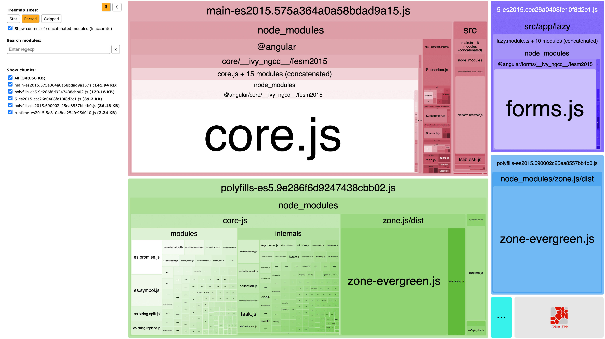
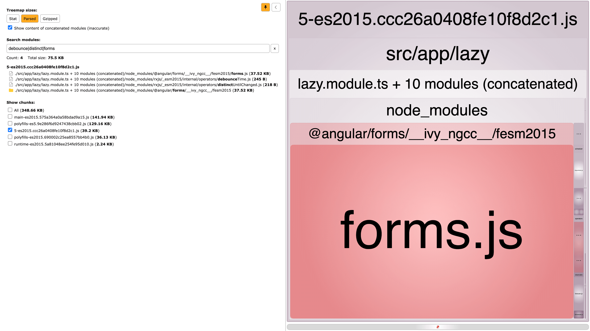
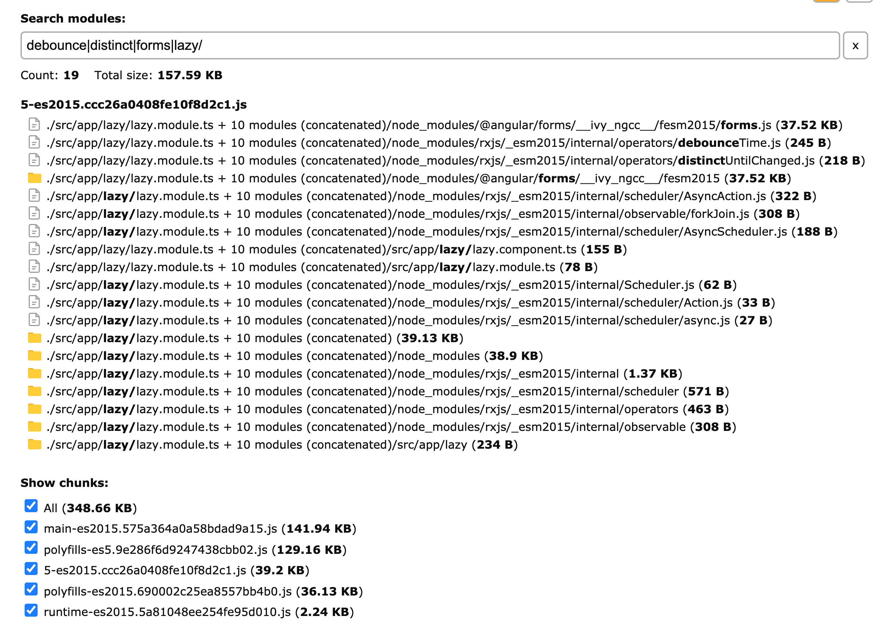

> The finished code is available on this
> [GitHub](https://github.com/danielddb/lazy-load-angular-components-view-engine)
> repo.

If you're working in an Angular project that uses View Engine and not the latest
[Ivy](https://angular.io/guide/ivy) compiler and runtime, it is not possible to
lazy load components on their own. This is because View Engine needs information
about all its declarable dependencies, their declarable dependencies, and so on.

Imagine you come across an advanced use case such as building a dashboard where
users can add X number of widgets, potentially loading X third-party libraries
such as charts, data grids, forms, etc. How do you do this whilst maintaining
good performance?

We'll work together through a solution how we can do this by creating a service
that can lazy load "component modules" in View Engine and also be compatible
with Ivy too.

## Getting Started

If you’re using Angular <= 7, you’re running on View Engine. Starting with
Angular 8, Ivy was released behind a flag in experimental mode, while in Angular
9 it is active by default.

> To disable Ivy in Angular 9, go to your `tsconfig.json` and set `enableIvy` to
> `false` in `angularCompilerOptions`.

Let's think about what we want to do here. We want to somehow lazy load a
component, but we can't lazy load a component on its own with View Engine
because they have to be declared in a module. We can however lazy load modules,
right? We know this because Angular Router can do it:

```ts
const routes: Routes = [
  {
    path: 'customers',
    // lazy loaded router module
    loadChildren: () =>
      import('./customers/customers.module').then(m => m.CustomersModule)
  },
  {
    path: 'orders',
    // another lazy loaded router module
    loadChildren: () =>
      import('./orders/orders.module').then(m => m.OrdersModule)
  }
];
```

So, let's start there and take a look at
[how Angular Router does it](https://github.com/angular/angular/blob/d06b6de409609edce1af0acabb9586da1eda128a/packages/router/src/router_config_loader.ts#L47).
The first branch of the `loadModuleFactory` method is for the deprecated way
where you specified `loadChildren` as a string (we'll ignore this part). The
else branch specifies `loadChildren` as a function that calls a dynamic import
and returns a module. This is exactly what we will need for the service we're
going to build.

We next need to think how we'll get a reference of the component we want to use
from a lazy loaded module. One way we could do this is by adding a static member
(let's call it `entry`) to a lazy loaded module with the component as the value.
So our lazy module will look something like this:

```ts
import { NgModule } from '@angular/core';
import { CommonModule } from '@angular/common';
import { LazyComponent } from './lazy.component';

@NgModule({
  declarations: [LazyComponent],
  imports: [CommonModule],
  entryComponents: [LazyComponent]
})
export class LazyModule {
  // This is the static member that lazy modules will use to indicate what component to load
  static entry = LazyComponent;
}
```

We'll call these lazy modules a **"component module"** from now on as the
component we want to load can only be created with an associated module.

With all this in mind, let's create a file called
`component-module-loader.service.ts` and create a public method to load the
component module:

```ts
import {
  Compiler,
  ComponentFactory,
  Injectable,
  Injector,
  NgModuleFactory,
  Type
} from '@angular/core';

@Injectable({ providedIn: 'root' })
export class ComponentModuleLoaderService {
  constructor(private compiler: Compiler, private injector: Injector) {}

  async loadComponentModule<T>(
    loadModuleCallback: () => Promise<Type<any> | NgModuleFactory<any>>,
    injector?: Injector
  ): Promise<ComponentFactory<T>> {
    // create the module factory from the loaded module
    const moduleFactory = await this.createModuleFactory(
      await loadModuleCallback()
    );

    // create the module reference and provide flexibility of what injector to provide
    const moduleRef = moduleFactory.create(injector || this.injector);

    // by adding the `entry` static prop to the lazy loaded module we
    // can easily get a reference of the component we want to work with
    const component = (moduleFactory.moduleType as any).entry as Type<T>;

    // retrieve and return the factory object that creates a component of the given type.
    return moduleRef.componentFactoryResolver.resolveComponentFactory(
      component
    );
  }

  // this is the logic taken from the angular router code 🙌
  private async createModuleFactory<T>(t: Type<T> | NgModuleFactory<T>) {
    // AOT compiled module
    if (t instanceof NgModuleFactory) {
      return t;
    }
    // JIT compiled module
    else {
      return await this.compiler.compileModuleAsync<T>(t);
    }
  }
}
```

## Create the Component Modules

Before we test `ComponentLoaderService`, let's create a component module to lazy
load. Run the following commands in your project:

```
ng g module lazy
ng g component lazy --module lazy --skipSelector --skipTests --inlineStyle --inlineTemplate --entryComponent
```

This should have created a directory called `lazy` with a component and module
(with the component added to the module's `declarations` and `entryComponents`
array).

Remember we need to add a static `entry` member to the module to indicate what
component we want to eventually create? Let's add this to `lazy.module.ts`:

```ts
// imports...

@NgModule({
  // declarations, entryComponents, etc...
})
export class LazyModule {
  static entry = LazyComponent; // <-- Here
}
```

We'll make our generated component more interesting and use Angular Forms and
RXJS so we can later better demonstrate why lazy loading our code is so
important. In `lazy.component.ts`, replace the code with:

```ts
import { Component } from '@angular/core';
import { FormControl } from '@angular/forms';
import { debounceTime, distinctUntilChanged } from 'rxjs/operators';

@Component({
  template: '<input type="text" [formControl]="messageControl" />'
})
export class LazyComponent {
  // An instance of a FormControl used to track the value and
  // validation status of the input control.
  readonly messageControl = new FormControl('');

  // An observable that emits an event (debounced by 300ms) every
  // time a distinct value is made from the form control.
  readonly messageChanges = this.messageControl.valueChanges.pipe(
    debounceTime(300),
    distinctUntilChanged()
  );
}
```

As we're using the `formControl` directive of Angular Reactive Forms in the
`LazyComponent` view, we'll need to update `lazy.module.ts` to import
`ReactiveFormsModule` from `@angular/forms`:

```ts
import { CommonModule } from '@angular/common';
import { NgModule } from '@angular/core';
import { ReactiveFormsModule } from '@angular/forms';
import { LazyComponent } from './lazy.component';

@NgModule({
  declarations: [LazyComponent],
  imports: [CommonModule, ReactiveFormsModule],
  entryComponents: [LazyComponent]
})
export class LazyModule {
  static entry = LazyComponent;
}
```

## Lazy Load the Component Modules

Okay, so now we have our `ComponentModuleLoaderService` and a component module
to lazy load, let's add a button to `app.module.ts` that when clicked will lazy
load our component module and render it.

```ts
import {
  Component,
  Injector,
  ViewChild,
  ViewContainerRef,
  ComponentRef
} from '@angular/core';
import { LazyComponent } from './lazy/lazy.component';
import { ComponentModuleLoaderService } from './component-module-loader.service';

// Map of component modules to load
const componentModules = {
  lazy: () => import('./lazy/lazy.module').then(m => m.LazyModule)
};

@Component({
  selector: 'app-root',
  template: `
    <div>
      <button (click)="lazyLoad()">Lazy Load</button>

      <div #vcr></div>
    </div>
  `
})
export class AppComponent {
  @ViewChild('vcr', { read: ViewContainerRef }) vcr: ViewContainerRef;

  private componentRef: ComponentRef<LazyComponent>;

  constructor(
    private loader: ComponentModuleLoaderService,
    public injector: Injector
  ) {}

  async lazyLoad() {
    // don't do anything if the component ref already exists
    if (this.componentRef) {
      return;
    }

    // lazy load the component module 🚀 and return us the component factory
    const factory = await this.loader.loadComponentModule<LazyComponent>(
      componentModules.lazy,
      this.injector
    );

    // instantiate the component and insert it into the container view
    const ref = this.vcr.createComponent(factory);

    // as we have a reference to the lazy loaded component, we can access the instance methods
    // also... don't forget to unsubscribe to any subscriptions 👀!
    ref.instance.messageChanges.subscribe(console.log);
    ref.instance.messageControl.setValue('Hi!');
  }
}
```

# Test It All Out

If you start up your app with `ng serve`, open the network tab and click the
"Lazy Load" button, you'll see our component module code is lazy loaded on click
🔥:


We can also test this using `ng serve --prod` (optimised production build) and
everything's still looking good 🔥🔥:


If you disabled Ivy previously, try re-enabling it again and run `ng serve` or
`ng serve --prod` again, and the code still gets lazy loaded 🔥🔥🔥.

# Analyze the Bundled Code

We'll use a tool called `webpack-bundle-analyzer` to analyze how our application
bundles are looking.

> `webpack-bundle-analyzer` allows you to visualize the size of webpack output
> files with an interactive zoomable treemap.

Add the following to your `package.json` scripts:

```json
{
  // ...
  "scripts": {
    // ...
    "analyze": "ng build --prod --stats-json && webpack-bundle-analyzer ./dist/angular-lazy-load-components/stats-es2015.json"
  }
}
```

If you run `npm run analyze`, it will open your browser with a nice visual
representation of our app bundles in the form of a zoomable treemap:



> Our component module chunk in this example is named
> `5-es2015.<OUTPUT_HASH>.js` as we're analyzing a production build of our code

The size of our main bundle is around 140 KB. If we were to eagerly load the
component module we created it would be around 180 KB. We saved around 40 KB by
lazy loading only one small module. Pretty cool!

Remember we imported RXJS (`debounceTime` and `distinctUntilChanged` operators)
and Angular Forms in our component code? If we inspect the component module
chunk and search for those modules, you can see them highlighted in red which
shows they've been bundled in our chunk:



We can go one step further and check if any of our component module code and its
imports have made it's way into the other application bundles:



As you can see all of our component module code is indeed isolated in it's own
chunk and has not made its way into the main bundle. Very nice!

## Conclusion

We've learnt that lazy loading components is possible in View Engine if they are
loaded with a module. This gives us more granular control of what we want to
lazy load compared to just lazy loading feature modules statically with Angular
Router. This enables great possibilities to optimise our application further
when it comes to making our initial bundle smaller and the application load time
faster.
