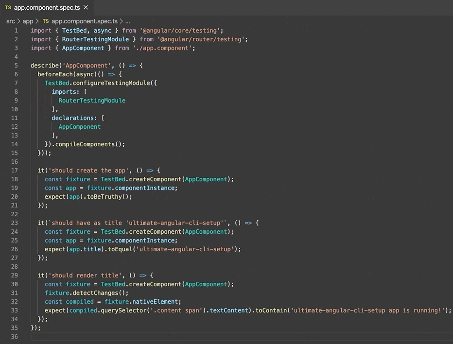

When you generate a project using the Angular CLI it uses
[TSLint](https://palantir.github.io/tslint/) out of the box. Whilst TSLint is
really good at linting **code quality**, it's not so good at formatting code.

This is where [Prettier](https://prettier.io) really shines as it focuses solely
on **code formatting** and it's really good at it too.

## Install and Configure Prettier

The first thing we're going to do is install Prettier:

```
npm i -D prettier
```

Next, you'll want to setup a configuration file. Prettier has a set of
[default options](https://prettier.io/docs/en/options.html) so you only need to
specify the options you wish to override. With that being said, create a
`.prettierrc` file in the root of your project:

```json
{
  "singleQuote": true
}
```

The only rule that's been overriden here is `singleQuote`, enforcing single
quotes instead of double quotes.

Next, I recommend you install the
[Prettier extension](https://prettier.io/docs/en/editors.html) for your IDE and
make sure you enable formatting on save. This will auto-format your code with
Prettier whenever you save your code.



## Remove conflicting formatting rules from TSLint

We now need to remove any conflicting code formatting rules from TSLint and let
Prettier handle that.

Luckily, there is a handy TSLint extension called
[tslint-config-prettier](https://github.com/prettier/tslint-config-prettier)
that helps take care of this:

```
npm i -D tslint-config-prettier
```

Then extend your `tslint.json` and make sure `tslint-config-prettier` is at the
end:

```json
{
  "extends": ["tslint:recommended", "tslint-config-prettier"]
  // other rules...
}
```

This will disable all conflicting TSLint rules from `tslint:recommended` and
`codelyzer`.

You'll then need to verify you have no conflicting rules under the `rules` map
of `tslint.json`:

```
npx tslint-config-prettier-check ./tslint.json
```

If you've never modifed `tslint.json` there will be rule conflicts such as
`align`, `eofline` and `import-spacing`.

Go ahead and remove those rules from your `tslint.json` file and then re-run the
previous command to check you have no more conflicts.

## Configure Git pre-commit hooks

> Git Hooks are scripts that Git executes before or after events such as:
> commit, push, and receive.

We're going to add two packages that will format our staged files with Prettier
and lint our code with TSLint using the `pre-commit` hook:

```
npm i -D husky pretty-quick
```

The [husky](https://github.com/typicode/husky) package lets you configure Git
Hooks in your `package.json` file and the
[pretty-quick](https://github.com/azz/pretty-quick) package runs Prettier on
changed files.

With this in mind, add the husky config to your `package.json`:

```json
{
  // ...
  "husky": {
    "hooks": {
      "pre-commit": "pretty-quick --staged && ng lint"
    }
  }
}
```

Now, whenever you attempt to commit your staged files, it will first format
staged files with Prettier and then commit the files in only if TSLint succeded
without errors 🚀.

## Configure Prettier for CI Environments

The final thing we need to do is to add a command that we can use in a CI
environment. In this particular case, we should check our source files and
return exit code 1 if something wasn't formatted properly. We can configure a
"format" npm script for this:

```json
{
  // ...
  "scripts": {
    // ...
    "format": "prettier --check \"**/*.{ts,js,json,html,css,scss,md}\""
  }
}
```

The `--check` flag will check if your files are formatted and output a
human-friendly message and a list of unformatted files, if any.

## Conclusion

You've learnt what Prettier is and how it can be configured in an Angular CLI
project. Personally it's been a huge time saver during code reviews as there's
no more time spent checking how code should be formatted, just let Prettier
handle it!
